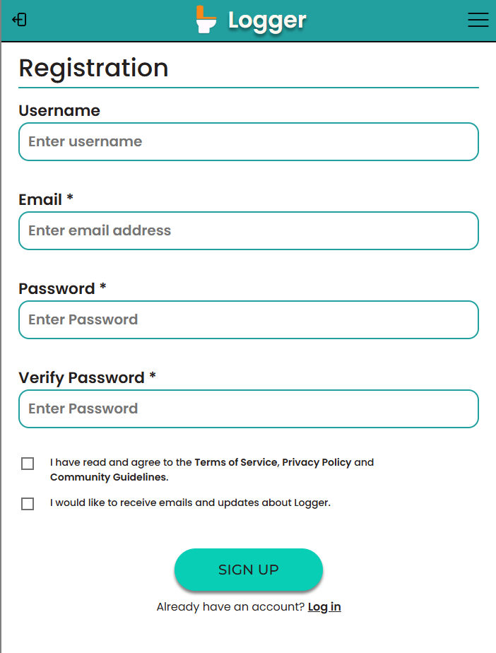
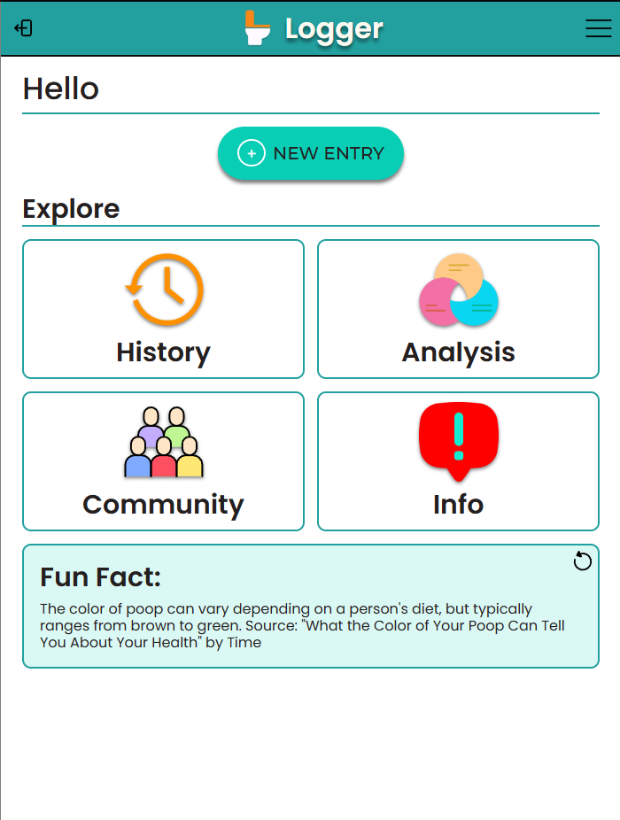
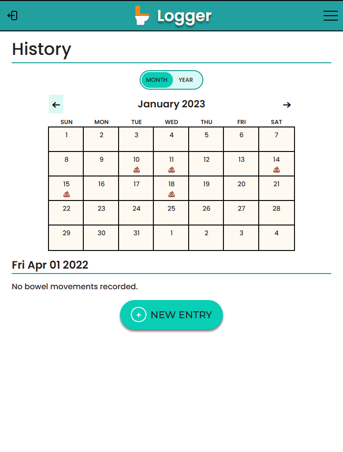
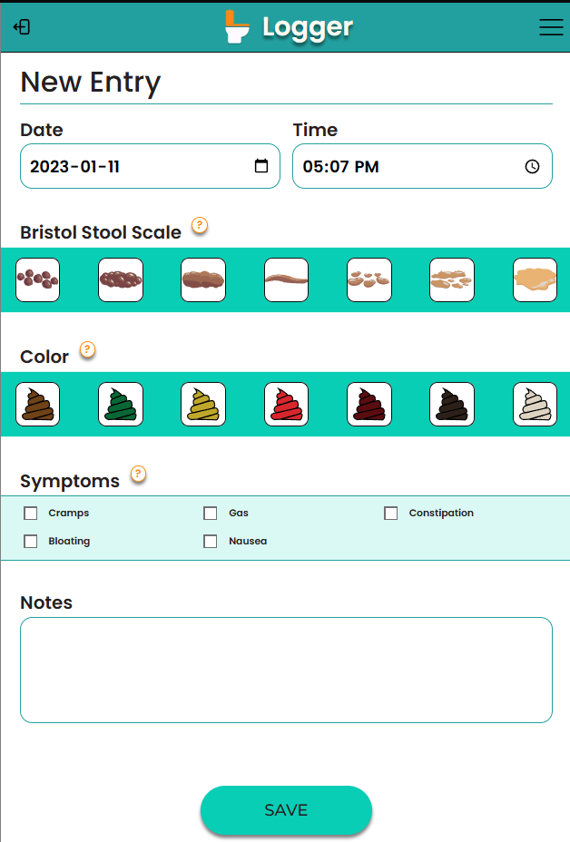
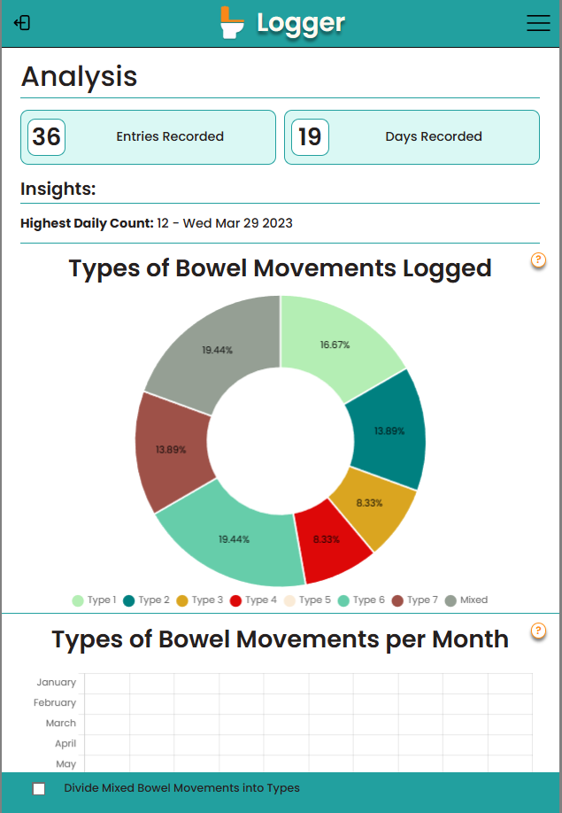
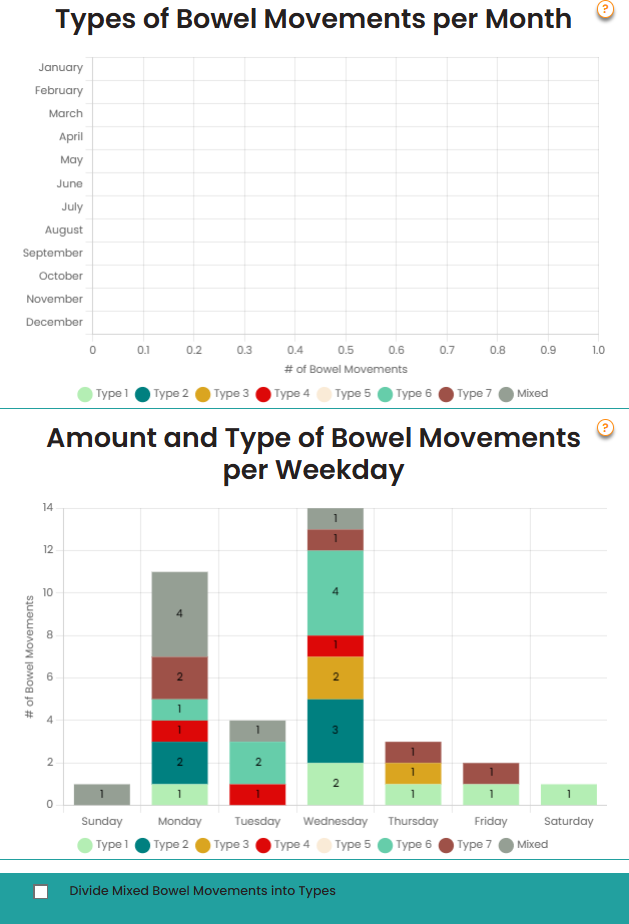

# 📊 A BM Tracking App for Health Monitoring! 🚀

This project is a health-focused tracking app designed to help users monitor their bowel movements (BMs) for better health insights. Proper tracking can be an important indicator of overall digestive health, and this app makes it easy and intuitive to log and analyze trends.

Key Features:

✔️ Easy Logging – Users can quickly record BMs, including details like time, consistency, and any symptoms.

✔️ Health Insights – Tracks patterns over time to help users understand their digestive health.

✔️ Data Visualization – Displays trends and changes in a user-friendly way to support better health decisions.

This project was a great opportunity to explore health tech, data tracking, and user-friendly app design. It reinforced my skills in frontend/backend communication, data handling, and UI/UX principles.


## Install backend and frontend dependancies:

```
cd frontend
npm install
```

```
cd ..
cd backend
npm install
```


## To run the app for development:

```
cd backend
npm run dev
```

## Enviroment Variables:
```
In the backend directory, create a .env file with values for the following variables:
MONGO_DB
PORT

In the frontend directory, create a .env file with a value for 
REACT_APP_API_URL 
```

## Database:
Sample data is provided in the sampledata folder. These can be uploaded to Mongo as starter information for the database. 

## Example:

A preview version:









A running preview version of the app is available at:
[poop-logger.onrender.com](https://poop-logger.onrender.com/)

